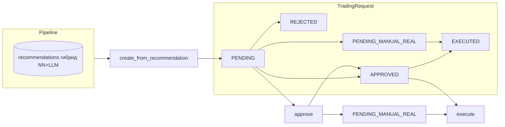

# Бизнес-логика серверной части (FastAPI)

См. также: [FRONTEND_BUSINESS_LOGIC.md](./FRONTEND_BUSINESS_LOGIC.md) — как домены отображаются в UI.

Документ описывает домены API, сквозные процессы и ограничения. Норматив по продукту и статусу фич: [REWRITE_CORE.md](../REWRITE_CORE.md). Исходная карта маршрутов: [server_fastapi/app/api/router.py](../server_fastapi/app/api/router.py) (все ниже — под префиксом `/api/v1`, если не указано иное).

**Как не путать термины (согласовано с REWRITE):**

| Слой | Что в REWRITE | Роль в продукте |
|------|----------------|-----------------|
| **Количественный core** | §2–§5: свечи/индикаторы (`pandas`/`sklearn`/`pandas_ta`), PyPortfolioOpt, связка «данные → доходности → веса → лимиты» | Риск, размер позиции, cap, preflight: [`/quant`](../server_fastapi/app/api/v1/quant.py), `MarketReturnsService`, `RiskPypfoptOrchestrator`, `RiskService.validate_order`, артефакт матрицы доходностей. Этот слой **обязателен** при проверке исполнения paper-заявок (§3.4). |
| **Нейросеть** | §7 как слой **над** PyPortfolioOpt/backtest (alignment, обучение) | Скоринг в job `analysis_market_portfolio` (`models/python_nn`), обучение — [`/training`](../server_fastapi/app/api/v1/training.py), JSONL alignment. |
| **LLM** | §8: **числовые факторы** и обогащение (`llm_consensus` / `llm_dispersion` в БД) | Жюри в job, payload в `Recommendation`, текстовый [`/portfolio-analyzer`](../server_fastapi/app/api/v1/portfolio_analyzer.py). |
| **Строка `Recommendation` в БД** | Питание пайплайна заявок и UI «список рекомендаций» | Запись из scheduler (fusion NN+LLM — **операционный** вердикт для отбора заявок); **не отменяет** проверки количественного core при `can_auto_execute`. |

Слова «рекомендация» в API/UI без уточнения обычно означают **запись в таблице `recommendations`**, а не отдельное заключение только PyPortfolioOpt (его результат попадает в лимиты и cap, см. §3.7).

---

## 1. Общие правила API

| Аспект | Описание |
|--------|----------|
| Базовый префикс приложения | HTTP-маршруты API монтируются с префиксом `/api` ([`main.py`](../server_fastapi/app/main.py)); версия v1 — [`router.py`](../server_fastapi/app/api/router.py). |
| Успешный ответ | Обёртка [`SuccessEnvelope`](../server_fastapi/app/schemas/envelope.py): `{ "success": true, "data": … }`. |
| Ошибка | [`ErrorEnvelope`](../server_fastapi/app/schemas/envelope.py): `{ "success": false, "error": { "code", "message", "details", "traceId" } }`; коды через [`AppError`](../server_fastapi/app/core/errors.py) (например `UNAUTHORIZED`, `BAD_REQUEST`, `BUSINESS_RULE_VIOLATION`, `SERVICE_UNAVAILABLE`). |
| Аутентификация | JWT Bearer для защищённых эндпоинтов ([`get_current_user`](../server_fastapi/app/api/deps.py), [`auth.py`](../server_fastapi/app/api/v1/auth.py): `POST /auth/login`, `GET /auth/me`, `POST /auth/verify`, `POST /auth/logout`). |
| Доп. health | Корневой `GET /health` вне `/api/v1` ([`main.py`](../server_fastapi/app/main.py)); внутри v1 — `GET /health` ([`health.py`](../server_fastapi/app/api/v1/health.py)). |

---

## 2. Карта доменов (модуль → роль → примеры эндпоинтов)

Полные пути: `/api/v1` + колонка «Префикс» + путь из кода.

| Префикс / модуль | Бизнес-роль | Примеры |
|------------------|-------------|---------|
| *(нет общего prefix)* [`health.py`](../server_fastapi/app/api/v1/health.py) | Liveness API v1 | `GET /health` |
| *(нет)* [`settings.py`](../server_fastapi/app/api/v1/settings.py) | Ключ-значение настроек (`AppSetting`), Kelly и т.д. | `GET /settings`, `PUT /settings`, далее по файлу |
| *(нет)* [`system.py`](../server_fastapi/app/api/v1/system.py) | Статус системы, KPI **fusion-анализа** (NN+LLM job), задачи планировщика, cutover/ops, триггеры job, WebSocket | `GET /system/status`, `GET /system/tasks`, `GET /system/analysis/kpi`, `POST /system/analysis/market-portfolio`, `WS /ws/system-status` |
| `/auth` | Вход, профиль, проверка токена | `POST /auth/login`, `GET /auth/me` |
| `/portfolio` | Реальный портфель Tinkoff; виртуальный paper; NAV; конфиг профилей; sync | `GET /portfolio`, `GET /portfolio/real/db`, `GET /portfolio/virtual`, `GET /portfolio/virtual/nav-history`, `GET /portfolio/virtual/profiles`, `GET /portfolio/virtual/profiles-config`, `GET /portfolio/position-recommendations`, `GET|POST /portfolio/sync`, `POST /portfolio/real/sync`, `GET /portfolio/sync/status` |
| `/trading-mode` | Режим `paper` / `real` / `micro` в настройках | `GET /trading-mode/current`, переключение — по файлу |
| `/trading-requests` | Жизненный цикл заявок: создание, preview, approve/reject/execute/cancel, статистика | `GET /trading-requests`, `POST /trading-requests/create`, `POST /preview`, `POST /{id}/approve`, … |
| `/auto-paper-trading` | Автоисполнение paper при включённом флаге | статус, `can-auto-execute`, см. [`auto_paper.py`](../server_fastapi/app/api/v1/auto_paper.py) |
| `/recommendation-pipeline` | Создание торговых заявок из **уже записанных** в БД рекомендаций (пороги, дедуп, multi-profile, авто-paper) | `POST /recommendation-pipeline/run` — [`recommendation_pipeline.py`](../server_fastapi/app/api/v1/recommendation_pipeline.py) |
| `/market` | Чтение инструментов, свечей, **выдача сохранённых** строк `recommendations` (не генерация с нуля) | см. [`market.py`](../server_fastapi/app/api/v1/market.py) |
| `/risk` | Валидация ордеров и лимиты (**количественный core** вместе с quant) | см. [`risk.py`](../server_fastapi/app/api/v1/risk.py) |
| `/quant` | **Количественный core** REWRITE §3–§5: PyPortfolioOpt, матрица доходностей, при флаге — индикаторы из свечей БД | `GET /quant/returns-matrix-artifact`, `POST /quant/indicators-preview` (если `INDICATORS_API_ENABLED`) |
| `/preflight-check` | Проверки перед real | [`preflight.py`](../server_fastapi/app/api/v1/preflight.py) |
| `/backtesting` | Бэктест (например SMA) | [`backtesting.py`](../server_fastapi/app/api/v1/backtesting.py) |
| `/portfolio-analyzer` | Текст по JSON-метрикам (LLM) — REWRITE §12, отдельно от гибридного `Recommendation` в scheduler | [`portfolio_analyzer.py`](../server_fastapi/app/api/v1/portfolio_analyzer.py) |
| `/reports` | Отчёты (в т.ч. daily-summary v2) | [`reports.py`](../server_fastapi/app/api/v1/reports.py) |
| `/portfolio-migration` | Статус/контур миграции legacy | [`portfolio_migration.py`](../server_fastapi/app/api/v1/portfolio_migration.py) |
| `/monitoring` | Алерты, SLO, свежесть quant-артефакта, метрики брокера | [`monitoring.py`](../server_fastapi/app/api/v1/monitoring.py) |
| `/training` | Обучение NN, LLM jury, release gate (Phase 4) — **слой §7–§8**, не смешивать с количественным core §2–§5 | [`training.py`](../server_fastapi/app/api/v1/training.py) |
| `/tinkoff` | Диагностика/обёртки Tinkoff | [`tinkoff.py`](../server_fastapi/app/api/v1/tinkoff.py) |
| *(нет prefix)* [`telegram.py`](../server_fastapi/app/api/v1/telegram.py) | Telegram: статус, сообщения, настройки уведомлений | пути вида `GET /telegram/status`, … |
| `/news`, `/performance`, `/profitability` | Новости, отчёты производительности, доходность | соответствующие файлы в `app/api/v1/` |

Сгенерированный клиент фронта: [`frontend/src/api/generated/services/`](../frontend/src/api/generated/services/) (имена сервисов совпадают с доменами).

---

## 3. Сквозные бизнес-потоки

### 3.1 Анализ рынка и генерация строк в таблице `recommendations`

**Норматив из [REWRITE_CORE.md](../REWRITE_CORE.md):** основной вердикт по рынку и портфелю опирается на **библиотечный количественный стек** (свечи/индикаторы, `pandas`/`sklearn`/`pandas_ta` — §2; оптимизация весов и риск — PyPortfolioOpt и связка «данные → доходности → веса → лимиты» — §3–§5). **Нейросети** в нормативе описаны как **слой над** PyPortfolioOpt/backtest (§7), **LLM** — как источник **числовых факторов** и обогащения (§8), а не как единственная «правда».

**Что делает код сегодня:** строки в БД (модель `Recommendation`) для сценария «список рекомендаций → пайплайн заявок» заполняет **фоновая задача** `analysis_market_portfolio` в [`scheduler.py`](../server_fastapi/app/scheduler.py) (триггер также через `POST /system/analysis/market-portfolio` в [`system.py`](../server_fastapi/app/api/v1/system.py)). Внутри job итоговые `BUY`/`SELL`/`HOLD` в строке собираются из **fusion** нейросетевого скоринга и LLM-жюри (ниже); это **операционный** сигнал для экрана и отбора в [`RecommendationPipelineService`](../server_fastapi/app/services/recommendation_pipeline_service.py). **Количественный core** (матрица доходностей, PyPortfolioOpt, лимиты позиции) применяется **отдельно** — в §3.7 и в [`AutoPaperService.can_auto_execute`](../server_fastapi/app/services/auto_paper_service.py) / `RiskService.validate_order` (§3.4); итог в поле `recommendation` из scheduler **не заменяет** эти проверки.

**Логика одного прохода по инструментам в `analysis_market_portfolio` (упрощённо):**

1. **Список целей** — все инструменты из справочника (`list_instruments`), далее фильтрация по фичефлагам и **canary** (доля FIGI обрабатывается по хэшу — `_is_canary_enabled_for_figi`), плюс runtime-настройки из `AppSetting` (`_analysis_runtime_settings`: включение анализа, процент canary, пороги fusion, TTL кеша LLM и т.д.).

2. **NN-сигнал** — инференс по чекпоинту в `models/python_nn` (`_run_nn_inference_for_figi`). Если чекпоинта нет, ветка NN считается недоступной; при ошибках инференса — `nn_failures`, но цикл по FIGI продолжается.

3. **LLM (жюри)** — опционально провайдеры из `_default_jury_providers` ([`training.py`](../server_fastapi/app/api/v1/training.py)); вызов `run_jury_for_figi` ([`llm_jury_service.py`](../server_fastapi/app/services/llm_jury_service.py)) с контекстом по последним свечам. Экономия вызовов: если NN уже «уверен» (score далеко от 0.5), LLM может быть пропущен (`llm_margin`); повторный вызов в тот же день может быть пропущен, если в записи рекомендации уже есть полноценный LLM-payload (**daily limit**). Есть in-memory кеш по FIGI+дате.

4. **Fusion** — веса `w_nn` / `w_llm` и пороги `buy` / `sell` зависят от **режима рынка** (`marketRegime` из NN payload) — `_adaptive_fusion_params`. Режимы итога: `nn_llm`, `nn_only`, `llm_only`; при полном отсутствии сигналов и включённых quality gates — деградация в нейтральный HOLD (`degrade_to_hold`), иначе FIGI может быть пропущен (`skipped_no_signal`).

5. **Итоговая рекомендация** — `BUY` если `final_score >= buy_threshold`, `SELL` если `final_score <= sell_threshold`, иначе `HOLD` (см. блок fusion в [`scheduler.py`](../server_fastapi/app/scheduler.py) ~2493–2501).

6. **Запись в БД** — `market_repo.upsert_recommendation` с полями `recommendation`, `confidence`, `score`, агрегированным `llm_jury_payload` / fusion (`fusion_payload` внутри), при необходимости `nn_score`, `nn_confidence`, `nn_checkpoint`, `nn_payload`. Для каждого FIGI после записи может вызываться обновление weekly forecast.

**Связь с торговым контуром:** по завершении цикла по всем инструментам планировщик **сразу вызывает** [`RecommendationPipelineService.run`](../server_fastapi/app/services/recommendation_pipeline_service.py) в режиме `paper` с `min_confidence=0`, `min_score=0`, `limit=50` — то есть пороги отбора заявок на этом шаге фактически задаёт уже сам пайплайн (см. §3.2), а не нули как финальные бизнес-правила.

---

### 3.2 Пайплайн recommendation-pipeline: от БД к торговым заявкам

HTTP: **`POST /api/v1/recommendation-pipeline/run`** ([`recommendation_pipeline.py`](../server_fastapi/app/api/v1/recommendation_pipeline.py)). Реализация — [`RecommendationPipelineService.run`](../server_fastapi/app/services/recommendation_pipeline_service.py).

**Вход:** последние рекомендации через `MarketRepository.list_recommendations` (лимит `limit`, по умолчанию 50).

**Пороги `confidence` / `score`** (функция `_resolve_pipeline_thresholds`, затем для paper — `max` с профилем moderate в [`run`](../server_fastapi/app/services/recommendation_pipeline_service.py)):

| Ситуация | Откуда берётся минимум | Числа по умолчанию в коде |
|----------|-------------------------|---------------------------|
| Query **`minConfidence` / `minScore` не переданы**, `mode=paper` | [`PAPER_PIPELINE_MIN_CONFIDENCE`](../server_fastapi/app/core/config.py), [`PAPER_PIPELINE_MIN_SCORE`](../server_fastapi/app/core/config.py) | **`0.35`** и **`0.35`** (диапазон 0…1; переопределяется `.env`) |
| Query **не переданы**, `mode` не `paper` | Константы `_DEFAULT_MIN_CONFIDENCE` / `_DEFAULT_MIN_SCORE` в [`recommendation_pipeline_service.py`](../server_fastapi/app/services/recommendation_pipeline_service.py) | **`0.5`** и **`0.5`** |
| После шага выше для **`mode=paper`** (если задан [`PortfolioProfileConfigService`](../server_fastapi/app/services/portfolio_profile_config_service.py)) | `max(порог из таблицы выше, пороги профиля **moderate**)` | В дефолтах кода до merge с БД/YAML для moderate: **`signal_min_confidence` = 0.62**, **`signal_min_score` = 0.6** (`_DEFAULT_BY_SLUG["moderate"]` в том же сервисе). Фактические значения moderate могут быть перезаписаны настройкой `portfolio.profiles` или `PORTFOLIO_PROFILES_YAML_PATH`. |
| Планировщик в §3.1 вызывает `run(..., min_confidence=0, min_score=0)` | Сначала в `_resolve` попадают **нули** (не `None`), поэтому env **0.35 не подставляется**; затем снова `max` с moderate | Эффективные пороги как у строки выше: **не ниже 0.62 / 0.6** при дефолтном moderate |
| Исследовательские заявки по `HOLD` (`PAPER_EXPLORATION_ENABLED`) | Помимо общих порогов пайплайна для строки — минимум **`PAPER_EXPLORATION_MIN_SCORE`** | По умолчанию **`0.55`** ([`config.py`](../server_fastapi/app/core/config.py)); действие по умолчанию **`PAPER_EXPLORATION_ACTION` = `BUY`** |

Итог: при стандартном `mode=paper` и отсутствии query **итоговые** пороги совпадают с полом moderate (**0.62** / **0.6**), потому что **0.35 < 0.62** и **0.35 < 0.6**. Явные `minConfidence` / `minScore` в query переопределяют только первый шаг, после чего для paper всё равно применяется `max` с moderate.

**Эффективный сигнал для строки (`_effective_trade_signal`):**

- В **paper** при `PAPER_SOFT_USE_DB_COLUMNS=true` (по умолчанию), если в строке заданы **`paper_recommendation`** / `paper_confidence` / `paper_score`, для отбора используются они — согласуется с идеей REWRITE §8 (**отдельные числовые поля** для paper); основное поле `recommendation` при этом может оставаться «жёстким» сигналом гибрида.
- При `PAPER_SOFT_HOLD_TO_BUY=true` сигнал `HOLD` может трактоваться как `BUY` для прохождения дальше по пайплайну (если paper-колонки не переопределили).

**Создание заявок:**

- Строка проходит, если `confidence` и `score` не ниже порогов и **эффективное действие** — `BUY` или `SELL` (иначе skip: `hold` / `threshold`).
- **Дедупликация:** для каждой пары `(figi, virtual_profile_slug)` проверяется отсутствие **активных** заявок (`count_active_by_figi_and_profile` или fallback `count_active_by_figi`).
- При **`PAPER_PIPELINE_MULTI_PROFILE=true`** и `mode=paper` для одного FIGI создаётся **до четырёх** заявок — по одной на каждый slug из [`VIRTUAL_PROFILE_SLUGS`](../server_fastapi/app/core/virtual_profiles.py) (после `normalize_virtual_profile`). Иначе — один профиль (moderate по умолчанию).
- Исключения при создании мапятся в `skipped` с причинами `budget`, `duplicate`, `error` и т.д.

**Исследовательские заявки (paper):** при `PAPER_EXPLORATION_ENABLED` из рекомендаций с `HOLD` отбираются топ по `score`; пороги — см. строку про `PAPER_EXPLORATION_MIN_SCORE` в таблице выше; действие по умолчанию — `PAPER_EXPLORATION_ACTION` = **`BUY`** — список `explorationCreated`.

**Автоисполнение и догон внутри `run`** ([`recommendation_pipeline_service.py`](../server_fastapi/app/services/recommendation_pipeline_service.py)) — детально:

1. **`_maybe_auto_execute_paper`** (сразу после каждой успешной **`create_from_recommendation`** в основном цикле и в ветке exploration):
   - Вызывается **только** при `mode=paper` и если в контейнере передан [`AutoPaperService`](../server_fastapi/app/services/auto_paper_service.py); иначе возвращается `(False, None)` и автоисполнение не считается.
   - Из ответа `create_*` берётся **`id`** заявки; если его нет или UUID невалиден — в сводку попадёт причина (`no_request_id` / `invalid_request_id`), автоисполнение не выполняется.
   - Иначе вызывается **`auto_execute_request`** (тот же путь, что при ручном `POST /trading-requests/create` с авто-paper): внутри — **`can_auto_execute`** → при успехе **`approve`** → для paper немедленно **`execute`** (см. §3.4).
   - При **`AppError`** (риск, пороги профиля, истёк срок, auto-paper выключен и т.д.) исключение **не пробрасывается наружу**: пишется лог `Pipeline: auto-paper не исполнил…`, в ответ пайплайна попадает запись в **`autoExecuteSkipped`** с полями `figi`, `profile` (если multi-profile), `requestId`, машинная **`reason`** (`_classify_auto_execute_skip_reason`) и **`detail`** (текст ошибки).
   - При успехе FIGI добавляется в список **`autoExecuted`** (для одного FIGI при multi-profile возможны несколько попыток по профилям — список отражает успешные исполнения по заявкам).
   - Итог по причинам пропуска агрегируется в **`autoExecuteSkippedByReason`**.

2. **`process_pending_paper_requests`** (в **конце** `run`, после обхода всех рекомендаций и exploration):
   - Вызывается **только** при `mode=paper` и наличии `AutoPaperService`; у репозитория заявок должен быть метод **`list_requests`**.
   - Если глобальный режим не `paper` или **`auto_paper_enabled`** выключен — возвращается заглушка с `note`: `not_paper_mode` / `auto_disabled`, **`attempted`: 0**.
   - Иначе из БД выбирается до **`limit=80`** заявок со статусом **`PENDING`** и **`mode=paper`** (порядок — как в [`list_requests`](../server_fastapi/app/repositories/trading_request_repository.py)).
   - Для **каждой** такой заявки снова вызывается **`auto_execute_request`** (те же проверки `can_auto_execute`, что и для «свежей» заявки). Успех: FIGI попадает в **`executedFigis`**; неуспех (`AppError` или иное исключение) — объект в **`failed`** с `figi`, `requestId`, `detail`.
   - **Зачем отдельный проход:** догон висящих **PENDING**, которые не исполнились сразу после создания (временный отказ риска, лимиты, auto-paper был выключен и включили позже, гонка с настройками и т.д.). Докстринг в коде: «догон после сбоев риска/настроек».
   - Результат кладётся в поле ответа API **`pendingPaperAutoRetry`** (`attempted`, `executedFigis`, `failed`, опционально `note` / `error`).

Общая ссылка на правила исполнения: §3.4. Отличие от **`POST /trading-requests/create`:** там при ошибке `auto_execute_request` ошибка **глотается** и клиент может увидеть `PENDING`; в пайплайне ошибка **учитывается** в **`autoExecuteSkipped`** / **`failed`**.

**Ответ API:** сводка `created`, `skipped`, `explorationCreated`, `autoExecuted`, `autoExecuteSkipped`, `autoExecuteSkippedByReason`, `pendingPaperAutoRetry`, `total`.

---

### 3.3 Торговые заявки и state machine

- Заявки создаются из FIGI рекомендации или из переданного `recommendationData` ([`trading_requests.py`](../server_fastapi/app/api/v1/trading_requests.py)).
- Допустимые переходы статусов заданы в [`TradingRequestService`](../server_fastapi/app/services/trading_request_service.py) (`_ALLOWED_TRANSITIONS`): из `PENDING` — в `APPROVED`, `PENDING_MANUAL_REAL`, `REJECTED`, `CANCELLED`, `EXPIRED`; терминальные статусы без исходящих переходов — `EXECUTED`, `REJECTED`, `CANCELLED`, `EXPIRED`.
- **Real:** `approve` может перевести в `PENDING_MANUAL_REAL` при ручном исполнении у брокера; `execute` фиксирует факт с опциональными `actualPrice` / `actualAmount`.
- Синтетические FIGI `TEST-*` могут быть запрещены (`ALLOW_SYNTHETIC_TRADING_FIGI=false`).

После ручного или пайплайнового создания заявки в режиме **paper** срабатывает логика **автоторговли paper** (§3.4).

---

### 3.4 Автоторговля в режиме paper

Автоисполнение объединяет три точки входа:

| Вход | Где | Когда |
|------|-----|--------|
| A | `POST /trading-requests/create` | После создания заявки `mode=paper`, если глобальный режим `paper` и `auto_paper_enabled` |
| B | [`RecommendationPipelineService`](../server_fastapi/app/services/recommendation_pipeline_service.py) | После `create_from_recommendation` внутри `run` — `_maybe_auto_execute_paper` |
| C | Тот же сервис | В конце `run` — `process_pending_paper_requests` (догон висящих `PENDING`) |

Во всех случаях исполнение идёт через [`AutoPaperService.auto_execute_request`](../server_fastapi/app/services/auto_paper_service.py) → **`can_auto_execute`** → при успехе **`approve`** (для paper внутри `approve` сразу вызывается **`execute`** — см. [`TradingRequestService.approve`](../server_fastapi/app/services/trading_request_service.py)).

**Условия попытки сразу после `POST /create` (вход A)**

1. `options.mode` нормализуется к **`paper`** (по умолчанию так и есть).
2. [`TradingModeService.get_current_mode()`](../server_fastapi/app/services/trading_mode_service.py) — **`paper`**.
3. Настройка **`auto_paper_enabled`** → `true` (`get_status().enabled`; см. `_coerce_bool` в [`auto_paper_service.py`](../server_fastapi/app/services/auto_paper_service.py)).
4. В ответе создания есть **`id`** заявки — по нему вызывается `auto_execute_request`.

Если п.2–3 не выполнены, заявка остаётся **`PENDING`**.

**Проверки `can_auto_execute` (все обязательны)**

| # | Условие |
|---|---------|
| A | Глобальный режим торговли **`paper`**. |
| B | **`auto_paper_enabled`** включён. |
| C | Заявка существует, статус **`PENDING`**. |
| D | Не истёк срок: `expires_at` не в прошлом (МСК). |
| E | Пороги **виртуального профиля** (если задан slug и есть конфиг): `score` / `confidence` не ниже `signal_min_score` / `signal_min_confidence` профиля. |
| F | Нижняя граница уверенности для риска: не ниже `max(env PAPER_PIPELINE_MIN_CONFIDENCE, порог профиля)` где применимо. |
| G | Снимок виртуального портфеля по slug и лимиты **`risk.maxPositionSize`**, для профиля — `max_position_fraction` / `max_total_exposure_fraction`. |
| H | Опционально: cap доли из **PyPortfolioOpt** по FIGI. |
| I | **`RiskService.validate_order`** возвращает `isValid`. |

**Успех:** для `mode=paper` клиент получает **уже исполненную** заявку (`approve` → немедленный `execute`).

**Отказ на `create`:** `AppError` из `auto_execute_request` **глотается** (`except AppError: pass`), в ответе остаётся **`PENDING`**. Догон — **`process_pending_paper_requests`**.

**Включение auto-paper:** [`AutoPaperService.enable`](../server_fastapi/app/services/auto_paper_service.py) только при глобальном **`paper`**, иначе `AUTO_EXECUTION_FORBIDDEN_NON_PAPER`.

---

### 3.5 Режим торговли (`paper` / `real` / `micro`)

- Хранится как настройка; сервис [`TradingModeService`](../server_fastapi/app/services/trading_mode_service.py): допустимые значения `paper`, `real`, `micro`; при некорректном значении в БД фактически ведёт себя как `paper`.
- Влияет на то, какой портфель ожидается в UI (реальный Tinkoff vs виртуальный) и на сценарии заявок (см. фронт-док).

### 3.6 Виртуальные профили и NAV

- Slug профилей нормализуются (например `conservative|moderate|aggressive|experimental`) — [`virtual_profiles.py`](../server_fastapi/app/core/virtual_profiles.py).
- Эффективные пороги: `GET /portfolio/virtual/profiles-config` (merge дефолтов, БД и опционально YAML при старте — `PORTFOLIO_PROFILES_YAML_PATH`).
- Multi-profile paper: при `PAPER_PIPELINE_MULTI_PROFILE=true` пайплайн может создавать заявки по всем slug без дубля `(figi, slug)` (см. REWRITE §13).
- История NAV: `GET /portfolio/virtual/nav-history`; снимки пишет cron `virtual_portfolio_nav_cron` ([`config.py`](../server_fastapi/app/core/config.py)).

### 3.7 Риск и quant (количественный core REWRITE §3–§5)

Здесь — **библиотечная** линия риска и оптимизации, не путать с полем `recommendation` в таблице `recommendations` из §3.1: оба участвуют в сделке, но разные роли (**лимиты и cap** vs **направление сделки из гибрида**).

- Оптимизация весов и cap в paper/real: `RiskOptimizationService`, `RiskPypfoptOrchestrator`, вселенная `risk.pypfopt_universe` ([REWRITE §3](../REWRITE_CORE.md)).
- Ночной артефакт матрицы доходностей (свечи → доходности — связка §5): job `quant_returns_matrix` → по умолчанию `data/quant/returns_matrix_latest.json` ([`quant_artifact_service.py`](../server_fastapi/app/services/quant_artifact_service.py)); чтение `GET /quant/returns-matrix-artifact`.
- Индикаторы RSI/Bollinger из БД при `INDICATORS_API_ENABLED` — REWRITE §2, не путать с NN-веткой в scheduler.
- Превью cap для real при флаге `RISK_REAL_CAP_PREVIEW_ENABLED` → [`risk.py`](../server_fastapi/app/api/v1/risk.py).

---

## 4. Фоновые задачи и артефакты

| Артефакт / данные | Назначение |
|-------------------|------------|
| `data/quant/returns_matrix_latest.json` | Матрица доходностей для quant/риска; обновление cron `quant_returns_matrix_cron` |
| `TRAINING_ALIGNMENT_DATASET_PATH` (JSONL) | Строки alignment для обучения (job `training_alignment_cron`) |
| `AUDIT_LOG_PATH` | Аудит: переключение режима, manual real и т.д. |
| `virtual_portfolio_nav_snapshots` (БД) | Дневные NAV для метрик/анализатора |
| MLflow / каталоги обучения | Phase 4 training — см. [`training.py`](../server_fastapi/app/api/v1/training.py) |
| Job `analysis_market_portfolio` | По FIGI: свечи в контекст LLM, NN-инференс, fusion → `upsert_recommendation` (**операционный** BUY/SELL/HOLD для UI/пайплайна); затем `RecommendationPipelineService.run` (paper). Количественные лимиты при исполнении — §3.4 / §3.7. См. §3.1–3.2 |
| Планировщик (прочее) | [`scheduler.py`](../server_fastapi/app/scheduler.py): портфель, цены, кеш, quant matrix, виртуальный NAV и др. |

Состояние задач и cron доступно через `system` API (`/system/tasks`, `/system/scheduler/status`) и WebSocket `/ws/system-status`.

---

## 5. Артефакты, конфликты и устаревшее

### 5.1 Документация и ссылки

- **Пофикшено:** в [REWRITE_CORE.md](../REWRITE_CORE.md) битая ссылка на `python_migration_docs/` заменена на [docs/BACKEND_BUSINESS_LOGIC.md](../BACKEND_BUSINESS_LOGIC.md); вступительный абзац таблицы статусов явно говорит, что старый индекс удалён.

### 5.2 Пересечения и путаница эндпоинтов

- **Два health:** **пофикшено (зафиксировано в OpenAPI).** `GET /health` на корне — для probe/LB; `GET /api/v1/health` — тот же контракт под версионированным префиксом. В [`main.py`](../server_fastapi/app/main.py) и [`health.py`](../server_fastapi/app/api/v1/health.py) добавлены `description`, чтобы не считать это ошибочным дублем.
- **Портфель sync:** **пофикшено.** В [`portfolio.py`](../server_fastapi/app/api/v1/portfolio.py) уточнены `summary`/`description`: `GET /sync` — live-снимок без задачи; `POST /sync` и `POST /real/sync` — постановка named jobs; `GET /sync/status` — очередь задач синхронизации.
- **System performance metrics:** **пофикшено.** Канонический путь — `GET /system/performance/metrics`. Путь `GET /performance/metrics` сохранён для совместимости, в OpenAPI помечен **`deprecated=True`** с отсылкой к каноническому URL ([`system.py`](../server_fastapi/app/api/v1/system.py)).

### 5.3 Feature flags и окружение

Поведение сильно зависит от `.env` ([`Settings`](../server_fastapi/app/core/config.py)). Важные флаги:

| Переменная | Эффект (кратко) |
|------------|-----------------|
| `TINKOFF_USE_GRPC` | gRPC для части read-path Tinkoff, иначе REST |
| `INDICATORS_API_ENABLED` | `POST /quant/indicators-preview` |
| `PAPER_PIPELINE_MULTI_PROFILE` | Заявки по всем виртуальным профилям в paper |
| `RISK_REAL_CAP_PREVIEW_ENABLED` | Cap preview для real в risk API |
| `PORTFOLIO_PROFILES_YAML_PATH` | Merge YAML профилей при bootstrap |
| `BROKER_HINT_AFTER_MANUAL_EXECUTE` | Телеметрия после manual real |
| `ALLOW_SYNTHETIC_TRADING_FIGI` | Разрешение FIGI `TEST-*` |
| `PAPER_SOFT_USE_DB_COLUMNS` | В paper пайплайне брать сигнал из `paper_*` колонок при их наличии (см. REWRITE §8, §3.2 в этом документе) |
| `PAPER_PIPELINE_MIN_CONFIDENCE` / `PAPER_PIPELINE_MIN_SCORE` | Нижние пороги для отбора заявок в paper-пайплайне (дополняются порогом профиля moderate) |

### 5.4 Заметки «на проверку»

- Комментарии «Фаза 4» / «Phase 5» в коде API — исторические якоря; **слой обучения/jury** см. таблицу в начале документа и REWRITE §7–§8, **количественный core** — §2–§5.
- `TradingModeService.can_switch_to` для `real` возвращает упрощённое «allowed» (детальная валидация может быть в других слоях) — не смешивать с preflight/risk UI.

---

## 6. Приложение: бумажная торговля — env и эффективные значения

Источник дефолтов для колонки «Значение по умолчанию»: [`Settings`](../server_fastapi/app/core/config.py) (переменные окружения = `alias` у поля, если он задан). Исключение: параметры **`app_settings`** хранятся в БД; при первом запуске подставляются из [`_seed_setting_defaults`](../server_fastapi/app/bootstrap.py) (не дублируют env, но задают **фактическое** поведение после bootstrap).

### 6.1 Переменные окружения, относящиеся к paper

| Переменная окружения | Значение по умолчанию | Зачем для paper |
|----------------------|----------------------|-----------------|
| `ALLOW_SYNTHETIC_TRADING_FIGI` | `true` | Разрешены FIGI `TEST-*` в заявках (в проде обычно `false`) |
| `PAPER_MDP_LOG_ENABLED` | `true` | Лог MDP `paper_mdp.jsonl` |
| `PAPER_MDP_LOG_PATH` | `./logs/paper_mdp.jsonl` | Путь лога MDP |
| `PAPER_EXPLORATION_ENABLED` | `false` | Доп. заявки по HOLD |
| `PAPER_EXPLORATION_MAX_EXTRA` | `0` | Лимит таких заявок |
| `PAPER_EXPLORATION_MIN_SCORE` | `0.55` | Мин. score для exploration |
| `PAPER_EXPLORATION_ACTION` | `BUY` | Действие для exploration |
| `PAPER_PIPELINE_MIN_CONFIDENCE` | `0.35` | Нижняя граница до `max` с moderate (§3.2) |
| `PAPER_PIPELINE_MIN_SCORE` | `0.35` | То же |
| `PAPER_SOFT_USE_DB_COLUMNS` | `true` | Использовать `paper_*` в пайплайне |
| `PAPER_SOFT_HOLD_TO_BUY` | `false` | HOLD → BUY для пайплайна |
| `PAPER_PIPELINE_MULTI_PROFILE` | `false` | Заявки сразу по всем slug-профилям |
| `USER_MAX_PORTFOLIO_BUDGET` | `1000000` | Бюджетные ограничения в риске |
| `MAX_POSITION_SIZE` | `0.02` | Дефолт в Settings (см. 6.3: в БД может быть `risk.maxPositionSize`) |
| `MIN_CONFIDENCE` | `0.6` | Общий мин. confidence в настройках приложения |
| `MAX_DRAWDOWN` | `0.15` | Порог просадки в настройках |
| `INDICATORS_API_ENABLED` | `false` | RSI/Bollinger в `/quant/indicators-preview` |
| `PORTFOLIO_PROFILES_YAML_PATH` | *(пусто)* | Опциональный YAML профилей при старте |
| `TINKOFF_USE_GRPC` | `false` | Read-path брокера: gRPC или REST |
| `RISK_REAL_CAP_PREVIEW_ENABLED` | `false` | Cap preview для real (для paper не основной сценарий) |

Остальные поля `Settings` (БД, JWT, Tinkoff token и т.д.) см. в [`config.py`](../server_fastapi/app/core/config.py).

### 6.2 Эффективные пороги пайплайна (не одна env)

При **`mode=paper`**, отсутствии `minConfidence` / `minScore` в query и **дефолтном** профиле **moderate** в коде ([`portfolio_profile_config_service`](../server_fastapi/app/services/portfolio_profile_config_service.py)) итог после `max(env, moderate)`:

| Параметр | Эффективное значение по умолчанию |
|----------|-----------------------------------|
| Минимум `confidence` для отбора в пайплайне | **`0.62`** |
| Минимум `score` | **`0.6`** |

Так как **`0.35`** < **`0.62`** и **`0.35`** < **`0.6`**, пороги из `PAPER_PIPELINE_MIN_*` поднимаются полом moderate. Если в **`portfolio.profiles`** или YAML заданы другие значения для moderate — используются они.

Вызов из планировщика с **`min_confidence=0`**, **`min_score=0`** даёт тот же эффект после `max` с moderate (§3.2).

### 6.3 Эффективные параметры из БД (`app_settings`) после seed

Не переменные окружения; задают поведение вместе с §6.1. Стартовые значения из [`bootstrap.py`](../server_fastapi/app/bootstrap.py) (пока ключ не переопределён в БД):

| Ключ | Значение по умолчанию (seed) | Смысл для paper |
|------|------------------------------|-----------------|
| `trading_mode` | `paper` | Глобальный режим |
| `auto_paper_enabled` | `false` | Автоисполнение paper-заявок выключено, пока не включат API/настройки |
| `risk.maxPositionSize` | `0.1` | Лимит доли позиции при **`RiskService.validate_order`** / auto-paper (перекрывает смысл дефолта `MAX_POSITION_SIZE` в env для этого пути — читается из БД) |
| `portfolio.virtual.initial_capital` | `50000000` | Стартовый виртуальный капитал (строка в seed) |
| `analysis_v2_enabled` | `true` | Включение ветки analysis v2 в scheduler |
| `analysis_v2_canary_percent` | `20` | Доля FIGI в canary |
| `analysis_v2_llm_uncertainty_margin` | `0.08` | Окно вызова LLM относительно NN |
| `analysis_v2_llm_cache_ttl_hours` | `6` | TTL кеша LLM |
| `analysis_v2_quality_gates_enabled` | `true` | Quality gates |
| `analysis_v2_conf_temp_nn_only` / `llm_only` / `nn_llm` | `1.0` | Temperature calibration |
| `portfolio.profiles` | `{}` | JSON профилей; пусто — берутся кодовые дефолты по slug |
| `risk.pypfopt_enabled` | `false` | Cap из PyPortfolioOpt в риске |
| `risk.pypfopt_universe` | `[]` | Вселенная FIGI для оптимизатора |

После изменений через **`PUT /api/v1/settings`** фактические значения только в БД.

---

*Версия: согласовано с кодом `server_fastapi` и [REWRITE_CORE.md](../REWRITE_CORE.md). При изменении роутера или контрактов — обновлять таблицу доменов, раздел 5 и приложение §6.*
