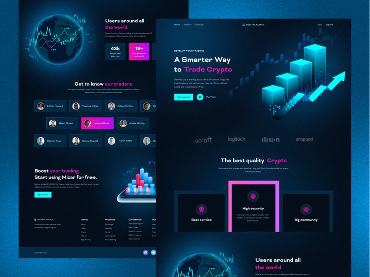
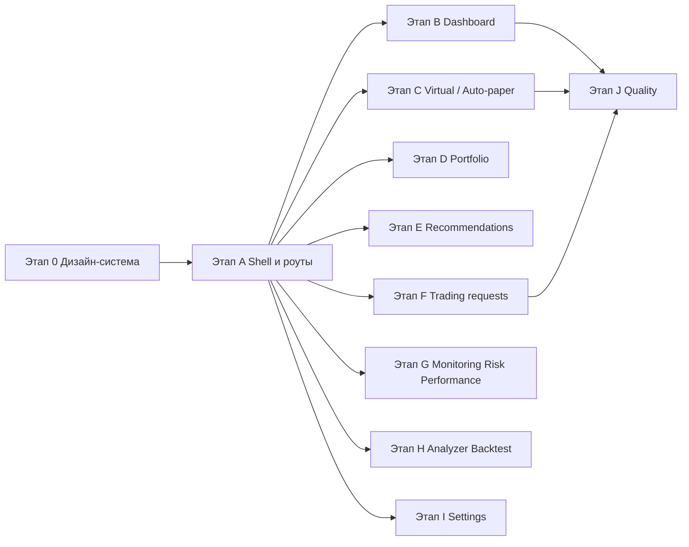

# План технической реализации frontend

Документ связывает [FRONTEND_BUSINESS_LOGIC.md](./FRONTEND_BUSINESS_LOGIC.md), [TARGET_FRONTEND_IA.md](../frontend/docs/TARGET_FRONTEND_IA.md) и фактическое состояние каталога `frontend/`. Цель — пошагово довести UI до соответствия согласованным сценариям и API.

**Порядок работ:** сначала **проектирование и фиксация дизайн-системы** (референс — скрин ниже), затем реализация shell, маршрутов и экранов на её основе. Иначе этап с UI-примитивами превращается в переделки.

**UI-основа (зафиксировано):** [MUI](https://mui.com/) (Material UI) — компоненты, темизация через `ThemeProvider` и `createTheme`, типичный стек: `@mui/material`, `@mui/icons-material`, при необходимости `@mui/x-data-grid` (см. §1.5).

**Статус плана (MVP): готово.** По состоянию на 2026-04-10 закрыты этапы **0–I** в объёме, описанном в документе: shell, маршруты, ключевые экраны, чеклист **§1.3** (включая опциональные **Tabs** / **Tooltip** — в текущей IA не используются; при необходимости подключаются из MUI без смены архитектуры). Дальнейшие UX-задачи вынесены в [FRONTEND_UX_ENHANCEMENTS_PLAN.md](./FRONTEND_UX_ENHANCEMENTS_PLAN.md).

---

## 1. Проектирование дизайн-системы

### 1.1. Референс (визуальный якорь)

В репозитории сохранена копия макета лендинга в тёмной неоновой эстетике:



Файл: [`docs/assets/ui-reference-landing-dark-neon.png`](./assets/ui-reference-landing-dark-neon.png).

Продукт — **торговое веб-приложение** (дашборд, таблицы, формы), а не маркетинговый лендинг; референс задаёт **настроение, палитру, типографику и принципы компонентов**, а не копируется как одностраничник. Hero, сетка «трейдеров» и 3D-иллюстрации на прикладных экранах не обязательны; **шапка, карточки KPI, таблицы, кнопки, сайдбар, алерты** должны быть согласованы с тем же языком.

### 1.2. Токены и тема (извлечь в код до вёрстки экранов)

| Категория | Референс                                           | Зафиксировать в DS                                                                        |
| --------- | -------------------------------------------------- | ----------------------------------------------------------------------------------------- |
| Фон       | Глубокий тёмный navy/black, ~`#0b0e11`             | `--color-bg`, `--color-surface`, `--color-surface-elevated`                               |
| Акцент 1  | Неоновый cyan / бирюза ~`#00E5FF`–`#00f2ff`        | `--color-accent-primary`, focus-ring, primary CTA                                         |
| Акцент 2  | Magenta ~`#FF007A`                                 | `--color-accent-secondary`, выделение в заголовках, «danger highlight», активная карточка |
| Текст     | Белый для заголовков, светло-серый для body        | `--color-text`, `--color-text-muted`                                                      |
| Радиусы   | Сильно скруглённые кнопки (pill), карточки ~8–12px | `--radius-sm`, `--radius-md`, `--radius-pill`                                             |
| Эффекты   | Внешнее свечение у акцентов и highlight-карточек   | утилиты `box-shadow` / `filter: drop-shadow`, вариант компонента Card `emphasized`        |
| Шрифт     | Современный геометрический sans (например Inter)   | подключить один семейство; шкала размеров и весов для UI, не для маркетинговых H1         |

**Подход:** dark-first; светлая тема — опционально позже. Токены — в `frontend/src/styles/` (например `_tokens.scss` + импорт в `index.scss`) или CSS variables на `:root`.

### 1.3. Основные компоненты (чеклист к реализации)

Ниже — **минимальный набор**, закрывающий сценарии из [FRONTEND_BUSINESS_LOGIC.md](./FRONTEND_BUSINESS_LOGIC.md) и shell из этапа A. Актуальная шпаргалка по файлам: [`frontend/docs/DESIGN_SYSTEM.md`](../frontend/docs/DESIGN_SYSTEM.md).

**Оболочка и навигация**

- [x] **AppShell / PageLayout** — область контента + слот под шапку/сайдбар.
- [x] **Sidebar** — группы пунктов (основной поток / мониторинг / аналитика), активное состояние, сворачивание на узких экранах.
- [x] **TopBar / Header** (опционально) — режим торговли, баланс-кратко, пользователь, кнопка меню на mobile.
- [x] **Breadcrumbs** (опционально) — для вложенных маршрутов вроде `/recommendations/:figi`.

**Формы и ввод (login, settings, фильтры, analyzer/backtest)**

- [x] **TextField / Input**, **Textarea**, **Select** (или Combobox), **Checkbox**, **Switch**.
- [x] **FormField** — label, hint, error; связка с валидацией.
- [x] **Button** — primary, secondary/ghost, danger (отклонить заявку), disabled, loading.
- [x] **DateRangePicker** или пара **Input type="date"** — фильтры заявок и отчётов.

**Отображение данных**

- [x] **Text / Heading** — шкала типографики из токенов.
- [x] **Card**, **Card** с вариантом `highlight` (акцентная рамка).
- [x] **DataTable** — сортировка, пустое состояние, skeleton; ячейки с **Badge** статусов.
- [x] **Badge / Tag** — статусы заявок, `paper` / `real` / `micro`, алерты.
- [x] **Stat / KpiTile** — число + подпись + дельта (дашборд).
- [x] **EmptyState**, **Spinner**, **InlineAlert / Callout** — ошибки API, «нет данных».

**Оверлеи и навигация по UI**

- [x] **Modal / Dialog** — подтверждение approve/reject/execute, превью заявки.
- [x] **Drawer** (желательно на mobile) — фильтры таблицы или вторичная форма.
- [x] **Tabs** — в текущей IA экраны разведены по маршрутам; при появлении табового UX — MUI `Tabs`/`Tab`.
- [x] **Tooltip** — по мере UX-ревью; базово доступен MUI `Tooltip`.

**Специфичные экраны**

- [x] **TradingRequestRow / ActionBar** — действия строго по допустимым переходам.
- [x] **ChartContainer** — обёртка над `lightweight-charts` (NAV, деталь FIGI): размеры, тёмная тема, resize.
- [x] **FilterBar** — композиция полей для `/trading-requests`, списков рекомендаций.

**Данные и графики (не «компоненты библиотеки», а контракт)**

- [x] Стили осей/сетки графиков под токены; сложные 3D с референса — вне MVP.

Варианты и визуальные состояния для примитивов (кратко):

| Компонент  | Варианты и состояния                                                          |
| ---------- | ----------------------------------------------------------------------------- |
| Button     | primary (cyan), secondary / ghost, danger, disabled, loading                  |
| Card       | default surface, `highlight` (magenta border + лёгкое свечение)               |
| Поля ввода | surface, border, focus (cyan), error                                          |
| Table      | границы/зебра в тон теме, hover-строка, горизонтальный скролл на узком экране |

### 1.4. Адаптив (обязательно заложить в DS и shell)

Цель — **читабельность таблиц и форм** на планшете и телефоне; десктоп остаётся основным для трейдинга.

| Тема               | Правило                                                                                                                                                                                    |
| ------------------ | ------------------------------------------------------------------------------------------------------------------------------------------------------------------------------------------ |
| **Брейкпоинты**    | Зафиксировать 2–3 порога в токенах, например `≤640px` (mobile), `641–1024px` (tablet), `≥1025px` (desktop). Использовать одни и те же значения в CSS и (если есть) в хуке `useMediaQuery`. |
| **Сетка страницы** | На desktop — несколько колонок KPI; на mobile — одна колонка, вертикальный стек.                                                                                                           |
| **Sidebar**        | На mobile: выезжающий **Drawer** / off-canvas по кнопке «меню», оверлей; на desktop — фиксированная или сворачиваемая колонка.                                                             |
| **Таблицы**        | На узкой ширине: горизонтальный `overflow-x: auto` + `min-width` у таблицы **или** переключение на **карточки по строке** (приоритет — не терять колонки статуса и действий).              |
| **Модалки**        | На mobile — почти на всю ширину/высоту (`100dvh` с учётом safe-area), крупная зона закрытия.                                                                                               |
| **Touch**          | Минимальная зона клика ~44×44px для частых действий (фильтры, меню).                                                                                                                       |
| **Графики**        | `ResizeObserver` или контейнер с `aspect-ratio` / фиксированной высотой; на mobile не обрезать легенду без прокрутки.                                                                      |

Проверка: ключевые маршруты (`/dashboard`, `/trading-requests`, `/recommendations`) вручную в DevTools (iPhone / iPad presets) + при необходимости один smoke-тест размеров.

### 1.5. Библиотека компонентов — **MUI** (решение по проекту)

**Принято:** в качестве основы UI используется **MUI (Material UI)**. Собственный kit «с нуля» не является целевым путём; кастом под неоновый референс — через **тему** (`createTheme`, `palette`, `components` overrides) и точечные `sx` / styled-компоненты для glow и highlight-карточек.

| Задача из §1.3    | Типичные примитивы MUI                                                                                                   |
| ----------------- | ------------------------------------------------------------------------------------------------------------------------ |
| Формы, фильтры    | `TextField`, `Select`/`MenuItem`, `Checkbox`, `Switch`, `Autocomplete` (при необходимости)                               |
| Кнопки, фидбек    | `Button`, `IconButton`, `CircularProgress`, `Alert`, `Snackbar`                                                          |
| Каркас, навигация | `Box`, `Stack`, `Grid`, `Drawer` (mobile sidebar), `AppBar`/`Toolbar` (опционально), `List`/`ListItemButton` для меню    |
| Таблицы           | `Table` + `TableContainer` для MVP; при росте требований — **MUI X Data Grid** (`@mui/x-data-grid`)                      |
| Оверлеи           | `Dialog`, `Drawer`, `Tabs`, `Tooltip`                                                                                    |
| Даты              | MUI X **Date Pickers** (`@mui/x-date-pickers`) + `dayjs` / `date-fns`, либо нативный `input type="date"` на первом этапе |

**Учёт:** «материальный» силуэт по умолчанию снимается настройкой `shape.borderRadius`, `elevation`/`box-shadow`, типографики и `palette.mode: 'dark'`. Импорты — **по путям** (`@mui/material/Button`) или с настроенным tree-shaking, чтобы не раздувать бандл.

**Интеграция с Vite:** следовать [официальной инструкции MUI](https://mui.com/material-ui/getting-started/installation/) (стандартный стек Material UI с Emotion совместим с Vite; кастом неона — в `theme` и `sx`, без смены движка стилей на первом этапе).

### 1.6. Движение и доступность

- **Motion:** в зависимостях уже есть `framer-motion` — использовать для появления панелей и микровзаимодействий, без перегруза лендинговыми анимациями; на mobile уважать `prefers-reduced-motion`.
- **A11y:** контраст текста к фону (WCAG), видимый focus, клавиатурная навигация в модалках и меню (MUI закрывает большую часть из коробки).

### 1.7. Критерий готовности этапа DS

- Все токены в одном месте, подключены к `index.scss` / теме библиотеки.
- Закрыт **чеклист §1.3** в объёме минимума для shell + login + одной табличной страницы (можно `/trading-requests` как эталон). **Выполнено.**
- Заложен **адаптив §1.4** (sidebar/drawer, таблица или карточки на mobile).
- Короткая внутренняя шпаргалка (таблица компонентов + скрин референса + **MUI**: путь к файлу темы и список overrides) для разработчиков — см. [`frontend/docs/DESIGN_SYSTEM.md`](../frontend/docs/DESIGN_SYSTEM.md).

После этого переходить к **этапу A** (роутинг и shell): пункт A.4 про UI-примитивы выполняется **на базе этой дизайн-системы**, а не «с нуля на глаз».

---

## 2. Исходная точка (наработки `frontend/`)

### 2.1. Уже есть и нужно сохранять как ядро

| Слой             | Расположение                                                              | Назначение                                                                                                                                                                                |
| ---------------- | ------------------------------------------------------------------------- | ----------------------------------------------------------------------------------------------------------------------------------------------------------------------------------------- |
| HTTP-клиент      | `src/api/client.ts`, `src/api/config.ts`, `src/api/generated/`            | База URL, Bearer, сгенерированные сервисы OpenAPI                                                                                                                                         |
| Сессия           | `src/services/auth.ts`, `src/services/storage.ts`                         | Логин, токен, `verifyStoredSession`                                                                                                                                                       |
| Trading core     | `src/store/tradingCoreStore.ts`                                           | Профиль, `TradingModeService`, портфель: при `paper` — `PortfolioService.getVirtualPortfolioApiV1PortfolioVirtualGet`, fallback на `SettingsService` + `portfolio.virtual.initial_capital`; иначе `getPortfolioApiV1PortfolioGet1` |
| Системный статус | `src/store/systemStatusStore.ts`                                          | WebSocket (`VITE_WS_SYSTEM_STATUS_PATH` или `/api/v1/ws/system-status`), задачи/планировщик; по событиям — `refreshPortfolio`                                                             |
| Доп. API заявок  | `src/api/tradingRequestsExtras.ts`                                        | `POST /trading-requests/preview`, cleanup — обходить до появления в codegen при необходимости                                                                                             |
| Хуки             | `src/hooks/useRequest.ts`                                                 | Обёртка над запросами (использовать на страницах)                                                                                                                                         |
| Тесты            | `src/store/__tests__/`, `src/services/__tests__/`, `src/hooks/__tests__/` | Регресс для сторов и auth — расширять под новые экраны                                                                                                                                    |

### 2.2. Состояние интеграции (актуально)

1. **Роутинг и shell:** защищённые маршруты, `ProtectedWithRealtime`, `RouteDataGuard`, `AppShell` + `appSidebar.ts` подключены; страницы этапов A–I реализованы, **lazy**-импорт в `App.tsx`, `Suspense` вокруг `<Outlet />` в shell.
2. **UI:** база — **MUI** + тема (`theme/`), без legacy `@/components/ui`.
3. **Virtual / lab API:** прямые вызовы `PortfolioService`, `PortfolioAnalyzerService`, `BacktestingService`; опционально общий хук `useVirtualPortfolioOverview` для сводки виртуальных профилей. Лаб-маршруты в меню и `App.tsx` управляются `VITE_ENABLE_LAB_ROUTES` (см. `frontend/src/config/labRoutes.ts`).
4. **Оставшиеся задачи качества:** см. этап J и чеклист [FRONTEND_BUSINESS_LOGIC §6](./FRONTEND_BUSINESS_LOGIC.md#6-чеклист-синхронизации-с-бэкендом) (в т.ч. регресс `generate:api`).

### 2.3. Paper-портфель в сторе (согласовано)

Для режима `paper` дашборд/шапка используют **`GET /api/v1/portfolio/virtual`**; при ошибке API — fallback на синтетику из `portfolio.virtual.initial_capital` (настройки). Полный NAV/профили — экран `/virtual-portfolios`. При необходимости позже: выбор `profile` query в сторе и синхронизация с UI профиля.

---

## 3. Целевая архитектура приложения

### 3.1. Слои

```
routes (App.tsx)
  → guards (сессия, опционально ensureLoaded по пути)
  → app shell (sidebar + outlet)
  → страницы (композиция виджетов)
  → данные: zustand (tradingCore, systemStatus, …) + useRequest / прямые вызовы services
```

- **Глобальное состояние:** не дублировать то, что уже в `tradingCoreStore` / `systemStatusStore`; для списков (заявки, рекомендации) — локальный state + react-query-подобный паттерн **или** лёгкие zustand-слайсы по мере усложнения.
- **Сгенерированный API:** единственный канон для имён методов; после смены OpenAPI — `npm run generate:api` и правка импортов (чеклист FRONTEND_BUSINESS_LOGIC §6).

### 3.2. Информационная архитектура меню (TARGET §6)

Свести к группам:

1. **Главная** — `/dashboard`
2. **Автоторговля** — `/virtual-trading` (смысл AutoPaper + обзор профилей; при необходимости редирект со старого `/auto-paper`)
3. **Виртуальные портфели** — `/virtual-portfolios` (NAV, профили, пороги — `PortfolioService` virtual\*)
4. **Портфель (реальный)** — `/portfolio`
5. **Рекомендации** — `/recommendations`, `/recommendations/:figi`
6. **Заявки** — `/trading-requests`
7. **Мониторинг** (опционально) — `/monitoring/alerts`, перекрёстные ссылки на риск
8. **Настройки** — `/settings`
9. **Аналитика и инструменты** (вторичное меню) — `/risk`, `/performance`, `/portfolio-analyzer`, `/backtest-sma`

Конфиг меню — один модуль (например `src/navigation/appSidebar.ts`), типы маршрутов — константы + `react-router` `RouteObject` или явный список `Route`.

---

## 4. Этапы реализации

### Этап 0 — Дизайн-система (блокирует качественную реализацию A.4)

Содержание — **раздел 1** этого документа: токены, референс-скрин, чеклист компонентов (§1.3), адаптив (§1.4), **MUI как основа UI** (§1.5), критерий готовности (§1.7).

**Критерий:** примитивы и глобальные стили готовы; можно подключать shell и страницы без смены палитры «в процессе».

### Этап A — Инфраструктура маршрутов и оболочки (блокирующий)

| #   | Задача                             | Детали                                                                                                                                                              |
| --- | ---------------------------------- | ------------------------------------------------------------------------------------------------------------------------------------------------------------------- |
| A.1 | Подключить `ProtectedWithRealtime` | Обернуть ветку защищённых маршрутов: после успешной сессии — `connect()` + `ensureLoaded()` (как в текущем `App.tsx`)                                               |
| A.2 | Маршруты `/login` и редиректы      | Публичный `/login`; `/` и неизвестные пути — логика как в `RootRedirect` (уже есть)                                                                                 |
| A.3 | Layout                             | Shell с `Sidebar` + `<Outlet />` в стиле DS (тёмная навигация, акцент активного пункта); для `/login` — отдельный layout (можно вплотную к референсу по фону и CTA) |
| A.4 | UI-примитивы и shell               | Реализация **по этапу 0**: обёртка приложения в MUI `ThemeProvider`, типографика/кнопка/инпут/карточка — **MUI + токены §1.2** в теме                               |
| A.5 | `RouteDataGuard`                   | Оставить вызов `ensureLoaded` при смене пути (кроме `/login`), либо встроить в layout                                                                               |

**Критерий готовности:** после логина открывается `/dashboard` с сайдбаром и без ошибок импорта.

### Этап B — Dashboard (`/dashboard`)

Сценарий FRONTEND_BUSINESS_LOGIC §3: режим торговли, капитал/баланс, сводка процессов.

| Источник       | Реализация                                                                          |
| -------------- | ----------------------------------------------------------------------------------- |
| Режим, баланс  | `useTradingCoreStore` — при необходимости доработать paper (см. §2.3)               |
| Задачи, health | `useSystemStatusStore` — виджеты «последние задачи», CPU/RAM при наличии в snapshot |
| Быстрые ссылки | Ссылки на `/virtual-trading`, `/trading-requests`, `/portfolio`                     |

**Критерий:** виджеты читают уже существующие сторы; лишние дубли KPI с `/performance` не вводить без явного решения (TARGET §5).

### Этап C — Виртуальный контур и автоторговля

| Маршрут               | Сервисы (generated)                                                                                                              | Примечание                                                                        |
| --------------------- | -------------------------------------------------------------------------------------------------------------------------------- | --------------------------------------------------------------------------------- |
| `/virtual-trading`    | `AutoPaperTradingService`, `TradingRequestsService`                                                                              | Статус auto-paper, последние заявки, переход в полный список                      |
| `/virtual-portfolios` | `PortfolioService`: `getVirtualPortfolio…`, `getVirtualNavHistory…`, `getVirtualPortfolioProfiles…`, `getVirtualProfilesConfig…` | График NAV (есть `lightweight-charts` в зависимостях), таблица профилей и порогов |

Опционально: общий хук `useVirtualPortfolioData` чтобы не размазать вызовы по страницам.

### Этап D — Реальный портфель (`/portfolio`)

- `PortfolioService.getPortfolioApiV1PortfolioGet1`
- `getPortfolioPositionRecommendationsApiV1PortfolioPositionRecommendationsGet`
- Ссылки на `/recommendations/:figi` где уместно

### Этап E — Рекомендации

- Список: `MarketService`, при необходимости `RecommendationPipelineService`
- Деталь: `:figi` — свечи/прогнозы согласно контракту API; **без** прямого исполнения сделки с карточки (исполнение — заявки + режим)

### Этап F — Торговые заявки (`/trading-requests`)

- CRUD-потоки через `TradingRequestsService`
- **State machine:** кнопки approve / reject / execute / cancel только при допустимых переходах (см. BACKEND_BUSINESS_LOGIC §3.3); disabled-состояния и тултипы
- Preview: `previewTradingRequest` из `tradingRequestsExtras.ts` (или сгенерированный метод, если появится в OpenAPI)
- Фильтры: статус, период, FIGI, режим; агрегаты по статусам в шапке таблицы

### Этап G — Мониторинг, риск, производительность

| Маршрут              | Сервис                                                   |
| -------------------- | -------------------------------------------------------- |
| `/monitoring/alerts` | `MonitoringService`                                      |
| `/risk`              | `RiskService`, при необходимости `PreflightCheckService` |
| `/performance`       | `PerformanceService`                                     |

Пометка в UI для «вторичных» экранов (TARGET §4).

### Этап H — Аналитика и лаборатория

| Маршрут               | Сервис                                                   |
| --------------------- | -------------------------------------------------------- |
| `/portfolio-analyzer` | `PortfolioAnalyzerService`                               |
| `/backtest-sma`       | `BacktestingService`, модели `SmaBacktestRequest` и т.д. |

Вынести в группу «Инструменты»; опционально feature-flag по `import.meta.env`.

### Этап I — Настройки (`/settings`)

- `SettingsService` (чтение/обновление пакетами)
- Секции по смыслу: ключи и флаги, Kelly, paper initial capital, уведомления, таймзона (TARGET §8.3)
- После сохранения — инвалидация: `tradingCoreStore.refreshPortfolio` / перезагрузка настроек в локальном state
- Связь с `SystemService` для триггеров кеша/задач — по мере наличия в API

### Этап J — Качество и синхронизация

| #   | Задача                                                                                                                   |
| --- | ------------------------------------------------------------------------------------------------------------------------ |
| J.1 | Чеклист FRONTEND_BUSINESS_LOGIC §6 — пройти по пунктам                                                                   |
| J.2 | Юнит-тесты: сторы (уже есть), новые утилиты (маппинг статусов заявок), компоненты с моками API                           |
| J.3 | Документировать допустимые переходы заявок в одном модуле (`tradingRequestTransitions.ts` или константы из бэкенд-спеки) |
| J.4 | Регресс `generate:api` в CI или вручную при изменении контракта                                                          |

---

## 5. Зависимости между этапами



Этапы C–I можно распределять параллельно после A; F логически опирается на ясную модель статусов из бэкенда. Этап 0 может частично идти параллельно с бэкенд-интеграционными заготовками, но **до** массовой вёрстки экранов его критерии готовности должны быть закрыты.

---

## 6. Риски и упрощения

1. **Референс vs продукт:** лендинг богаче по графике, чем операционный UI — не копировать 1:1; достаточно токенов, кнопок, карточек, таблиц и графиков в той же палитре.
2. **Дублирование экранов:** строго следовать TARGET §6–7: не плодить три независимых «главных» с одинаковыми KPI.
3. **Тесты и `import.meta`:** избегать жёсткой привязки env в нетестируемых модулях; конфиг WS/base URL уже частично в `api/config` — придерживаться того же паттерна.
4. **Адаптив не откладывать:** если собрать только desktop shell, позже дорого переделывать таблицы и навигацию; правила §1.4 и drawer для sidebar закладывать вместе с этапом A.
5. **MUI и бандл:** импортировать компоненты точечно, по необходимости подключать MUI X (Data Grid / Date Pickers) отдельно; не импортировать неиспользуемые иконки пакетом целиком.

---

## 7. Ссылки на артефакты

- Визуальный референс дизайн-системы: [`docs/assets/ui-reference-landing-dark-neon.png`](./assets/ui-reference-landing-dark-neon.png)
- Бизнес-сценарии и таблица «маршрут → API»: [FRONTEND_BUSINESS_LOGIC.md](./FRONTEND_BUSINESS_LOGIC.md)
- Целевая IA и принципы: [TARGET_FRONTEND_IA.md](../frontend/docs/TARGET_FRONTEND_IA.md)
- Домены и state machine заявок: [BACKEND_BUSINESS_LOGIC.md](./BACKEND_BUSINESS_LOGIC.md)
- Следующая итерация UX: [FRONTEND_UX_ENHANCEMENTS_PLAN.md](./FRONTEND_UX_ENHANCEMENTS_PLAN.md)

---

_Версия: 2026-04-10 (MVP **закрыт**); UI-основа: **MUI** (§1.5); чеклист §1.3, адаптив §1.4; согласована с текущим снимком `frontend/src`._
